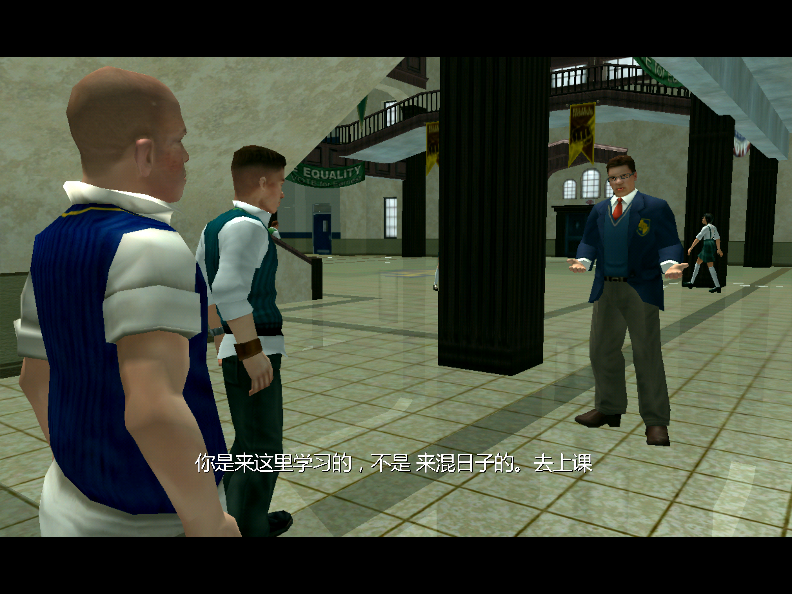
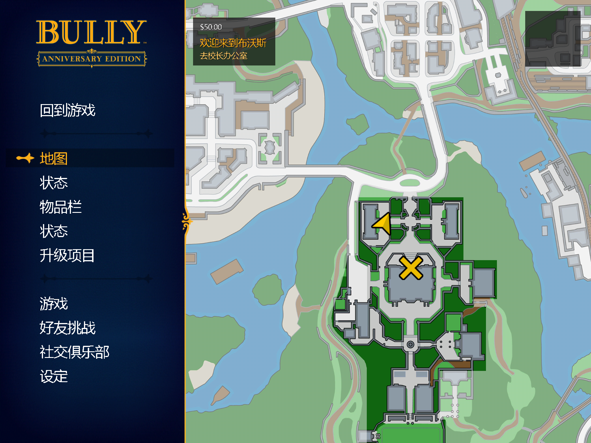
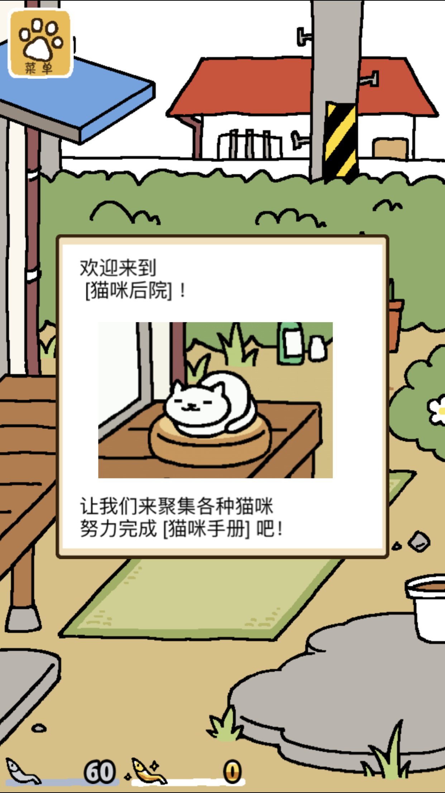
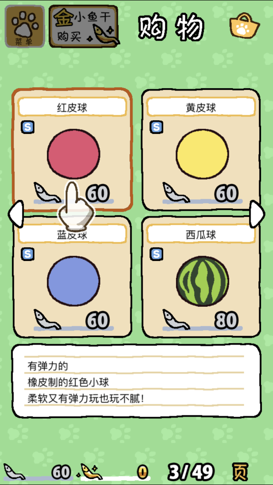

##基于Catption Hook 的IPA汉化

基于windows平台的游戏汉化，软件汉化已经比较成熟，网上的教程攻略，帖子也非常多。但是基于iOS平台的软件汉化网上却鲜有资源。我这里想说的是两个比较另类的软件汉化方法。由于项目有些久远，记忆有些偏差，可能有部分内容记录的会有问题。  
###1. 跨平台游戏的汉化
多数跨平台的游戏，可执行文件资源可能都是基于同一套代码编译。那么对于跨平台游戏的汉化可以采用借尸还魂的方法。当然该方法可能并不通用，智能能够借尸还魂还要看具体的游戏。例如恶霸鲁尼，这款游戏其实是跨平台的游戏，在我要汉化这款游戏的时候Windows平台的游戏已经有3dm的汉化版本。为了提高汉化速度和减少工作量，就可以采用使用3dm已经汉化的资源替换iOS版本的资源的方式进行汉化。
汉化后效果（iPad截图）：   
  
  

由于当时的记录记得比较简略， 只有如下几行，如果想要分析具体的改动内容可以下载汉化版ipa(链接: https://pan.baidu.com/s/142dUnjCkL-OV4POi1-9FxQ  密码: dk59)参考目录下的压缩文件进行对比：  
> 1.  替换xml
> 2. 替换font
> 3. 替换english（菜单崩溃）
> 4. 替换menu(从提取菜单文件夹提取menu文件)
 zip -0 -qr /Users/obaby/Desktop/恶霸鲁尼/恶霸鲁尼_-1.03.5/Payload/bully.app/Bully2.zip .
zip -0 -r Bully3.zip Bully  


###2. 基于Hook的汉化
不管是游戏汉化还是游戏破解，汉化后的资源都比较难以进行保护。如果要进行相关的资源保护，不让劳动成果被轻易的窃取，那么可以通过注入dylib动态解密资源信息。例如两年前比较流行的旅行青蛙，还有个姊妹产品叫做猫咪后院。这个游戏如果要汉化可以采用和旅行青蛙一样的方式，直接修改资源。
那么除了直接修改资源文件，那么有没有更简单的方法完成汉化呢？通过分析游戏的渲染可以发现，最终游戏的问题都是通过HpLib_Graphics makeTextImage:]函数来实现的贴图。那么，如果直接hook该函数，将要渲染的文本做成一个字典进行动态匹配，那么也就解决了汉化的问题。并且同时可以保证自己的dylib在被别人去除掉之后游戏的汉化将会失效。从某种程度上也就保证了自己的dylib的存活概率，当然这个不能保证dylib一定会被存活，如果分析了dylib的具体原理，那么完全可以自己写一个dylib替换现有的dylib。那么就需要进行进一步的保护，对翻译的字典文件进行加密，进一步提高被替换的成本。
渲染函数的原型如下：  
```javascript
id __cdecl -[HpLib_Graphics makeTextImage:](HpLib_Graphics *self, SEL a2, id a3)
```  
Hook代码：  
```javascript
@class HpLib_Graphics;
CHDeclareClass(HpLib_Graphics);
CHOptimizedMethod(1, self ,id, HpLib_Graphics, makeTextImage,NSString *, arg1)
{
    NSLog(@"BABY_HOOK: makeTextImage original:%@",arg1);
    NSString * ch_string = @"喵喵喵";
    if ([ch_dic objectForKey:arg1]) {
        ch_string =[ch_dic objectForKey:arg1];
        if ([ch_string length]== 0) {
            ch_string = @"喵喵喵";
        }
        NSLog(@"BABY_HOOK: makeTextImage chinese:%@",ch_strin
        return CHSuper(1, HpLib_Graphics,makeTextImage, ch_string);
    }else{
        return CHSuper(1, HpLib_Graphics,makeTextImage, arg1);
    }
}


// 猫咪后院
CHLoadLateClass(HpLib_GSystem);
CHHook(1, HpLib_GSystem, strNSString);

CHLoadLateClass(NSPlaceholderString);
CHHook(3, NSPlaceholderString ,initWithBytes,length,encoding);
CHHook(2, NSPlaceholderString ,initWithCString,encoding);
CHHook(1, NSPlaceholderString ,initWithUTF8String);

CHLoadLateClass(HpLib_Graphics);
CHHook(1, HpLib_Graphics, makeTextImage);
    
```
下一步就是加密翻译文本字典，通过BABYStringEncoding来实现，这个库是Google的一份开源代码，代码修改了类名和方法名。
解密通过如下代码实现：
```javascript
        NSString *cn_file = [[NSBundle mainBundle]  pathForResource:@"cn_strings_jp" ofType:@"hppy"];
        
        BABYStringEncoding * gtc2 = [[BABYStringEncoding alloc] initWithString:@"aCDEfGHijKlMnopQRsUvWXz012345689"]; //WxEHUf2GfEnCosHjE3j5zUs //aCDEfGHijKlMnopQRsUvWXz012345689
        
        
        NSError *err;
        NSString *encodeString = [NSString stringWithContentsOfFile:cn_file encoding:NSUTF8StringEncoding error:nil];

        NSData *decodeData = [gtc2 decode:encodeString error:&err];
        
        //NSString *decodeString = [[NSString alloc] initWithData:decodeData encoding:NSUTF8StringEncoding];
        
        //NSDictionary *decodeDic = [NSJSONSerialization JSONObjectWithData:decodeData options:kNilOptions error:&err];
        
        NSString *error;
        NSPropertyListFormat format;
        NSDictionary* plist = [NSPropertyListSerialization propertyListFromData:decodeData mutabilityOption:NSPropertyListImmutable format:&format errorDescription:&error];
        NSLog( @"BABY_HOOK: plist is %@", plist );
        if(!plist){
            NSLog(@"BABY_HOOK: Error: %@",error);
        }
        
```
除了上面的渲染函数，另外可能还有其他的需要处理的方法，并不是所有的文本都是通过这个渲染函数来实现的，还有一部分是通过其他的方法实现的。具体可以参考项目里面的代码。

汉化效果：  
  
  

字典文件加密解密方法：   
> 加密key aCDEfGHijKlMnopQRsUvWXz012345689
> 
> 加密：
> GTM_Encoder  -encodeFile 加密key 要加密的输入文件 输出加密文件
> GTM_Encoder  -encodeFile aCDEfGHijKlMnopQRsUvWXz012345689 /Users/obaby/Desktop/小项目/汉化保护/cn_strings_jp.plist /Users/obaby/Desktop/小项目/汉化保护/cn_strings_jp.enc
> 揭秘：
> GTM_Encoder -decodeFile 加密key 要解密的输入文件 输出解密文件
> GTM_Encoder -decodeFile aCDEfGHijKlMnopQRsUvWXz012345689 /Users/obaby/Desktop/小项目/汉化保护/cn_strings_jp.enc /Users/obaby/Desktop/小项目/汉化保护/cn_strings_jp.plist.dec